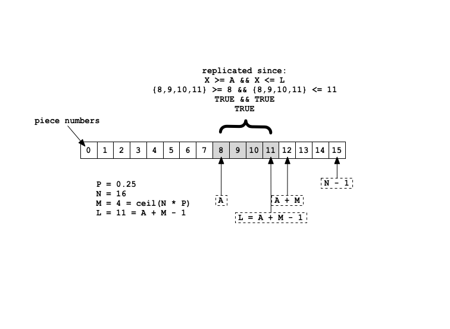
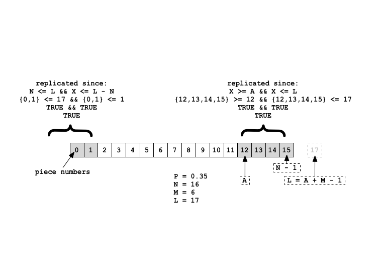
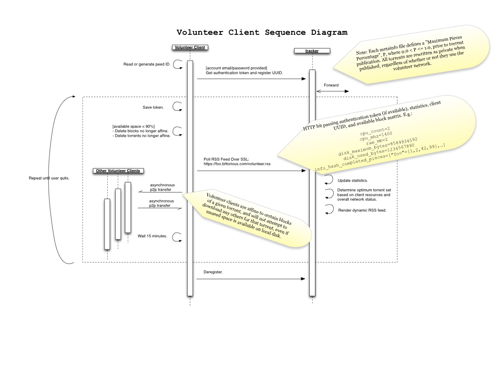

:BEP: 41
:Title: Volunteer Peer Partial Replication & Balancing
:Version: $Revision$
:Last-Modified: $Date$
:Author:  Preston Lee <preston.lee@prestonlee.com>
:Status:  Draft
:Type:    Standards Track
:Created: 23-January-2013
:Post-History:

Abstract
========

Storage-intensive tasks such as bioinformatics, particle physics simulation, and space sensor capture often require huge data sets to be transferred large geographic distances. Projects such as World Community Grid create “volunteer computing” networks to distribute computational workloads across distributed networks of philanthropic “donor” machines via a central control server, but analogous concepts for volunteer storage have not been broadly adopted, despite great need in scientific communities.

While many implementations of distributed file systems have emerged, these are generally designed on the presumption that the user replicating content is also consuming the content, which is not necessarily the case. Additionally, fields such as genomics deal with data that cannot necessarily be “public” in nature. DNA data, for example, may or may not be made available for public consumption due to legal, ethical, scientific, or other concerns.  The storage requirements of such organizations could be greatly displaced by providing several extensions to standard BitTorrent semantics, making academic and scientific studies in “big data” fields cheaper and more operationally sustainable, while also allowing layman to fulfill storage and archiving needs while not necessarilly being granted the ability to hold all data at a given moment in time.

Volunteer Network Semantics
================================

Peers acting as volunteer in the swarm MUST attempt to download only the pieces assigned to them, as well as validate that other peers are requesting only those assigned to them.

Volunteer Peer
----------------

 The concept of a “volunteer client” is similar to a normal peer, except the client:

- MUST support BEP-0036 to retrieve a dynamic list of torrents from an RSS generator.
- MUST inform the tracker of “storage space available”, as well as several other parameters, when requesting a feed as defined by BEP-0036.
- MUST ONLY download torrent pieces as commanded by the tracker, up to available local storage. In the event the tracker changes its commands, the client MUST delete non-authorized pieces no later than the new pieces have completed downloading.
- MUST enforce BEP-0027, when appropriately enabled by a metainfo file.
- SHOULD make all network communications, including all tracker and P2P interaction, over SSL.
- SHOULD use local piece-level encryption when writing to disk.
- MUST obey a “time to live” (TTL) on every torrent, in minutes. When the time since last announce exceeds -he * TTL, the client MUST delete all pieces for the given torrent.
- MUST observe and report certain configuration parameters and statistics to the tracker. (Described below.) 

Outside of these core semantic differences, a volunteer client uses the existing BitTorrent P2P wire protocol.

Users
--------

Additionally, the controlling user is assumed to be running the client as a storage contributor and MAY or MAY NOT desire to open the data they are storing. Since this expected user interaction MAY be different, the user:

- SHALL be allowed to control when the client runs.
- SHALL be allowed to set maximum storage and bandwidth contributions to the swarm.
- MAY be allowed to set other detailed P2P configuration parameters.
- MAY select a preference for specific RSS feed(s), which MUST be obeyed by the client when specified.
- MAY NOT know the torrents that have been joined.

Tracker & RSS Generator
--------------------------------

Each tracker, presumably integrated with a BEP-0036 RSS feed generator, issues commands to the client through a combination of dynamic RSS feed and announce request/response cycles. Tracker modifications SHOULD be implemented and are highly encouraged, but are not required. Implementors SHOULD NOT authoritatively trust the clients self-reported statistics are true. Self-reported system information is provided for optional piece balancing consideration by the RSS generator.

When the client initially polls the RSS feed(s), the following additional parameters SHOULD be provided in the HTTP query string:

====================              ========================================                      ==========  ========
Key                               Example Value                                                 Units       Required
====================              ========================================                      ==========  ========
peer_id                           2dd028f....c538ad                                             peer ID     Yes
user                              me@example.com                                                account ID  No
token                             AOEU!@#$1234                                                  string      No
cpu_count                         2                                                             int         No
cpu_mhz                           1433                                                          MHz int     No
ram_mb                            8589934592                                                    bytes long  No
disk_maximum_bytes                34359738368                                                   bytes long  Yes
disk_used_bytes                   1234567890                                                    bytes long  Yes
completed_pieces                  {‘e2d...3c2’=[0,7,42],‘80d..2f2’=>[]}                         JSON map    Yes
====================              ========================================                      ==========  ========

Notes:

completed_pieces
   A JSON structure mapping the "info_hash" of torrents to an array of piece numbers that have be fully downloaded by this peer.
user
   Typicaly a username or email address identifying the user.
token
   A secret string known only by client and server. When used in conjuction with the "user" field, it is recommended to treat it as a "password" or "API key".

The RSS generator MAY use this information, as well as the announce history of the tracker, to dynamically decide which torrents, if any, the client should join. Authentication and authorization checks SHOULD be performed to prevent client spoofing, but is not required to function in a trusted network.

Metainfo Files
----------------

Individual BitTorrents divide content into a number of pieces, N, at the time of torrent creation. Hashes for each piece are included in the .torrent metadata file, which allows clients to validate the correctness of individual piece transfers.

To facilitate the tracking process, a volunteer tracker MAY observe a “volunteer=1” option in the peer announcement request. When this flag is set, the peer value of “left=0” SHALL reflect the total number of bytes need by the client to reach its own assigned portion of the torrent, not the number of bytes needed to download the entire torrent.

Unlike standard bittorrent, each torrent metainfo file defines a Volunteer Client Percentage, P, keyed as “percentage” at the root level of the metainfo file. The value being expressed is a real number between 0 (exclusive) and 1 (inclusive), which is the maximum percentage of pieces any given volunteer client may replicate before it MUST force itself to stop downloading pieces. The value MAY be safely ignored by clients not operating as a volunteer. The total number of pieces a client shall download per torrent, M, is thus the same  for every volunteer participating in the torrent, and is always rounded up to the nearest integer value.

   *M = ceiling(N * P)*

All M pieces download by a given client MUST be limited to a contiguous region of piece numbers starting at an "Affinity Offset", A, defined by each client as:

   *A = MD5(concat(peer_id, torrent_info_hash)) % M*

Since both the Peer ID and torrent info_hash are known to the tracker, A does not need to be explicitly reported between the two. The last piece, L, to be downloaded -- in terms of offset number and not necessarily reflective of the order in which pieces are downloaded -- is defined as:

   *L = (A + M - 1)*

The client will only attempt to locally replicate a given piece number, X, if and only if the following function evaluates true:

   *should_replicate(X) := (X >= A && X <= L) || (N <= L && X <= L - N)*

The first half of the expression handles common cases where every block has a sequential piece number. This fails, however, when the pieces per torrent, M, would require a piece “past” the end of the torrent. (See examples.) In this case, the latter half of the expression allows the pieces to “wrap around” to the beginning of the torrent data at piece #0.

A tracker supporting this protocol MAY implement a piece priority tracking component to return a suggested piece acquistion order as part of the normal client announce. When the client sets the “volunteer” bit in the announce as defined above, the tracker MAY return an order array within the root level of the dictionary, keyed by “piece_priority”. Upon receiving this response, the client SHOULD obey this request.

For example, the tracker implementation MAY establish a priority queue per torrent, for identifying the least available blocks. The queue orders the pieces from top (highest priority) to bottom, with the least currently seeded pieces at the top, subsorted by the least seeded in the last D days, where D is left to the tracker to define.

Examples
========

The piece-limiting characteristics of a client may be easier to understand with two common examples:

Typical Case
----------------

Let’s say a torrent has 16 pieces, with a defined allowance of  25% of pieces per torrent, as illustrated in the following diagram, for a client whose affinity offset happens to be 8. This, as well as every other volunteer client, will attempt to acquire 4 pieces.

   **Figure 1:** The first 768 bytes of the RC4 pseudorandom
   string are discarded.  The parameter *i* in the tracker response has
   value ``x xor i``.  The parameter *n* has value ``y xor n``.

Wrap-Around Case
----------------

Now let’s consider a different torrent and different client, in the diagram below. N is still 16, but P has been raised to 35% and A happens to be 12. Since L is greater than or equal to N, the first two pieces will also be included in the clients acquisition list.

   **Figure 2:** A sequential set of pieces from the middle of the torrent is replicated by this peer.

Volunteer Client Lifecycle

   **Figure 1:** The set of pieces to be replicated "wraps around" to the beginning of the torrent, at piece #0.

References
==========

.. [#BEP-0010] BEP 10: Extension Protocol
   (http://www.bittorrent.org/beps/bep_0010.html)
.. [#BEP-0027] BEP 27: Private Torrents
   (http://www.bittorrent.org/beps/bep_0027.html)
.. [#BEP-0036] BEP 36: Torrent RSS Feeds
   (http://www.bittorrent.org/beps/bep_0036.html)

Copyright
=========

This document has been placed in the public domain by Preston Lee. 

.. [#author] Preston Lee
   (http://www.prestonlee.com)
.. [#github] GitHub
   (https://github.com/preston)


..
   Local Variables:
   mode: indented-text
   indent-tabs-mode: nil
   sentence-end-double-space: t
   fill-column: 70
   coding: utf-8
   End:
